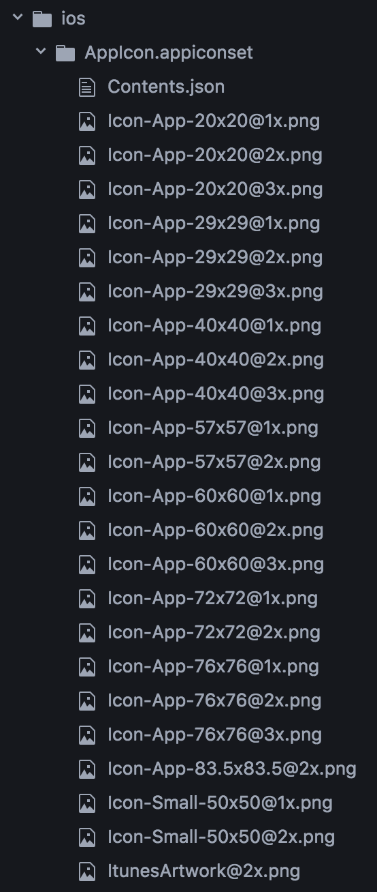
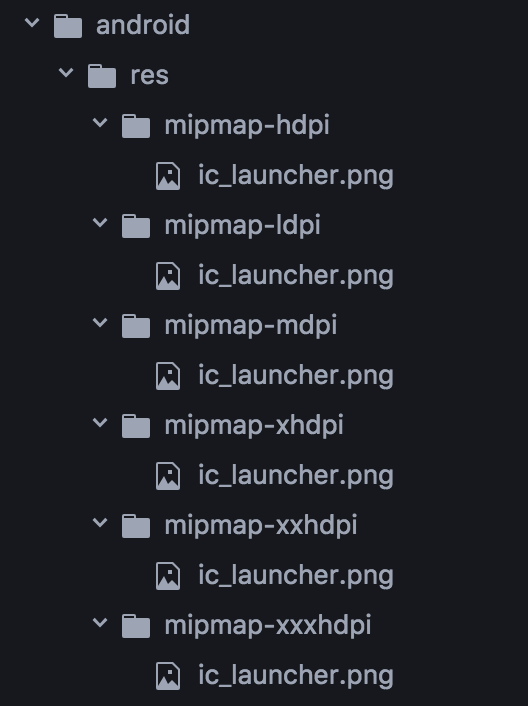

# icon-toolkit #

Dynamic app icon generator for iOS, Android

[](https://www.npmjs.com/package/icon-toolkit)
[](https://travis-ci.org/pavjacko/icon-toolkit)
[](https://coveralls.io/r/pavjacko/icon-toolkit)
[](https://codeclimate.com/github/pavjacko/icon-toolkit)
[](https://david-dm.org/pavjacko/icon-toolkit)
[](https://david-dm.org/pavjacko/icon-toolkit#info=devDependencies)

## Installation

`npm install --save icon-toolkit`

## Usage

IconToolkit API is Promise based

#### Usage 1 (Basic):

```js
import IconToolkit from 'icon-toolkit'

IconToolkit.generateIcons({
  source: '/Users/userX/sourceImage.png'),
  destinationFolder: '/Users/userX/exportIcons')
}).then(() => console.log('SUCCESS!'))

```

#### Usage 2 (iOS / Android split):

```js
import IconToolkit from 'icon-toolkit'

IconToolkit.generateIcons({
  source: '/Users/userX/sourceImage.png'),
  ios: {
    destinationFolder: '/Users/userX/myIosIcons')
  },
  android: {
    destinationFolder: '/Users/userX/myAndroidIcons')
  }
}).then(() => console.log('SUCCESS!'))

```

#### Usage 3 (Advanced):

```js
import IconToolkit from 'icon-toolkit'

IconToolkit.generateIcons({
  ios: {
    source: '/Users/userX/iOSImage.png'),
    destinationFolder: '/Users/userX/myIosIcons')
  },
  android: {
    source: '/Users/userX/androidImage.png'),
    destinationFolder: '/Users/userX/myAndroidIcons')
  }
}).then(() => console.log('SUCCESS!'))

```

#### Output

| iOS        | Android           |
| :-------------: |:-------------:|
|  |  |

## Contributing ##

Basicaly clone, change, test, push and pull request.

## License ##

icon-toolkit is licensed under the MIT license.
